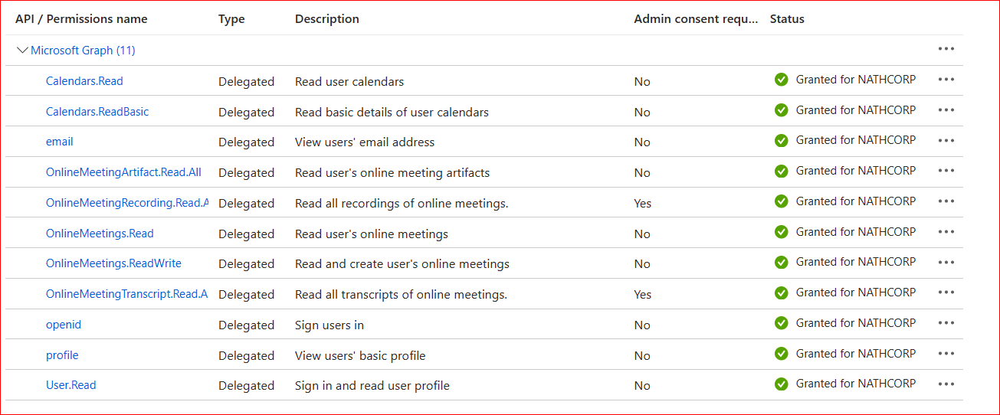

# MeetingSummariser

## HOW TO RUN: 
run in terminal `python -m streamlit run Login.py`

## PRE REQISITE:
Add your values in .env
1. CLIENT_ID="YOUR CRED"
2. TENANT_ID="YOUR CRED"
3. CLIENT_SECRET="YOUR CRED"
4. CLIENT_SECRET_ID="YOUR CRED"

i have below permissions in app registrations:

